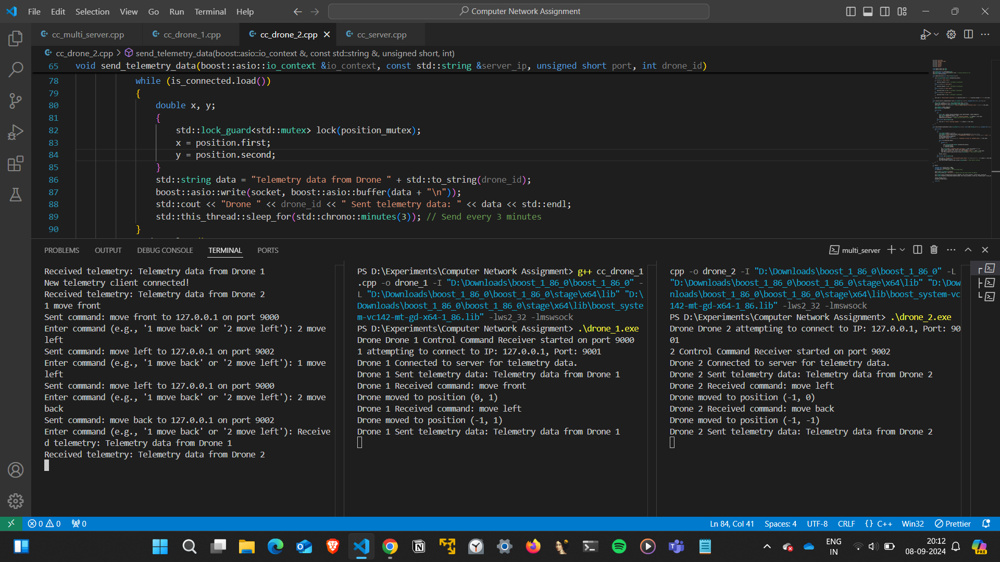

# Tri-Mode Communication System for Autonomous Drones

This project implements a tri-mode communication system for controlling a fleet of autonomous drones, sending telemetry data, and transferring large files. The system includes two main components: the Drone and the Server.

## Features

- **Control Commands**: The server sends movement commands to the drone via UDP.
- **Telemetry Data**: The drone periodically sends its positional data to the server via TCP.
- **File Transfer**: The drone periodically transfers large files to the server via TCP.

## Components

1. **Drone**: Simulates the drone's behavior, including receiving control commands, sending telemetry data, and transferring large files.
2. **Server**: Manages the communication by receiving telemetry data, sending control commands, and receiving files from the drone.

## Dependencies

- C++17 or higher
- Boost.Asio
- A C++ compiler like `g++`

## Usage

1. **Start the Server**  
   Run the server in one terminal:

   ```bash
   ./server
   ```

2. **Start the Drone**  
   Run the drone in another terminal:
   ```bash
   ./drone
   ```

## Drone Commands

The server can send the following movement commands to the drone:

- `move front`
- `move back`
- `move left`
- `move right`

These commands update the drone's position, and the telemetry data is sent back to the server.

## File Transfer

Every 10 minutes, the drone sends a large file to the server. Ensure the drone has the correct file path for transmission.

### Example of Sending a File

Place a large file (e.g., `big_file.txt`) in the project directory, and the drone will automatically send it after the telemetry connection is established.

## Encryption

All data sent between the drone and server is encrypted using an XOR cipher with a predefined key.

## Modifying Ports and IPs

You can change the ports and IP addresses by modifying the following variables in `drone.cpp` and `server.cpp`:

- **Control Port**: The port used for sending/receiving control commands (UDP).
- **Telemetry Port**: The port used for telemetry data (TCP).
- **File Transfer Port**: The port used for transferring files (TCP).

## Results

The following pictures were taken while running the program:


- **Figure 1**: Multi Drone - Sending Control Commands
  
- **Figure 2**: Multi Drone - Telemetry Data Received
  
- **Figure 3**: Multi Drone - File Transfer
